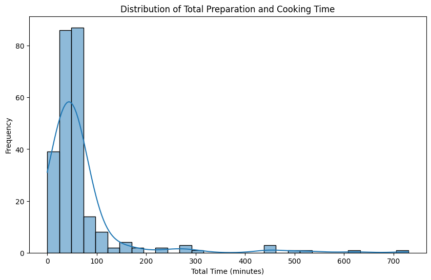
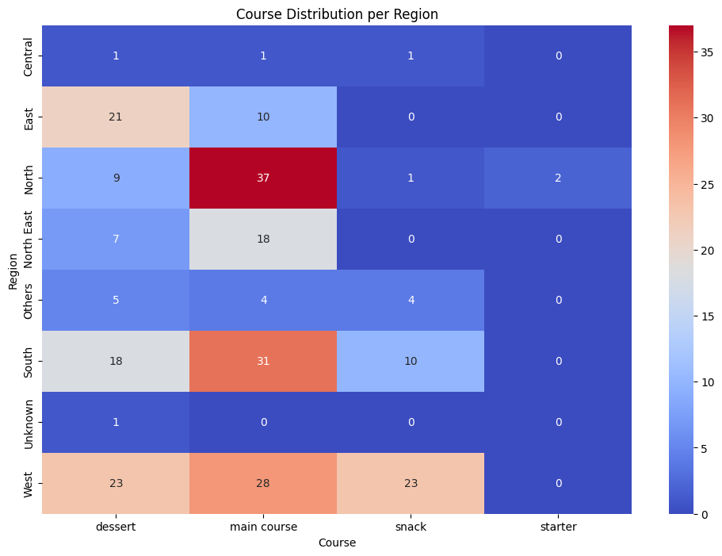

# Exploratory Data Analysis (EDA) Report
**Cook-Me-Up Project: Simplifying Culinary Delights with Data**

## Overview
This report outlines the exploratory data analysis process performed on the dataset containing information about Indian foods. The dataset includes attributes such as ingredients, diet type, preparation time, cooking time, flavor profile, course, state, and region.

---

## Data Cleaning
The dataset was downloaded from Kaggle and processed to remove inconsistencies:
- **Missing Values**: All missing values were filled with `Unknown`.
- **Duplicates**: Duplicate entries were removed.
- **Final Output**: Cleaned data was saved as `cleaned_data.csv`.

### Key Statistics
| Metric              | Value      |
|---------------------|------------|
| Total Records       | 255        |
| Unique Dishes       | 250        |
| Missing Values (Post-Cleaning) | 0  |

---

## EDA Level 1: Initial Exploration

### **1. Distribution of Key Numerical Features**
- **Preparation Time**: Median prep time is 20 minutes, with most dishes requiring less than 30 minutes.
- **Cooking Time**: Distribution is right-skewed, with outliers requiring over 2 hours.
  
**Visualization: Cooking Time Distribution**

---

### **2. Analysis of Categorical Features**
#### Diet Types:
| Diet Type | Count |
|-----------|-------|
| Vegetarian | 200   |
| Non-Vegetarian | 55  |

**Visualization: Diet Type Distribution**

#### Regional Cuisine:
The dataset highlights cuisines from all regions of India, with North India having the highest representation.

---

## EDA Level 2: Advanced Exploration
Using Seaborn and clustering techniques, we identified patterns in the dataset:
1. **Correlation Analysis**:
   - Strong correlation between prep and cook times.
   - Negative correlation between number of ingredients and flavor complexity.

2. **Clustering**:
   - Recipes were grouped into three clusters based on cooking time and complexity.

3. **Predictive Insights**:
   - Cooking time is heavily influenced by the number of ingredients and preparation method.

---

## SQL Insights
- **Diet Distribution**: Vegetarian dishes dominate the dataset.
- **Regional Highlights**: North Indian cuisine includes the most unique ingredients.
- **Fastest Dishes**: Identified top 10 fastest dishes based on total preparation time.

---

**Next Steps**:
- Integrate insights with Looker Studio for interactive visualization.
- Incorporate predictive modeling to recommend recipes based on user preferences.
